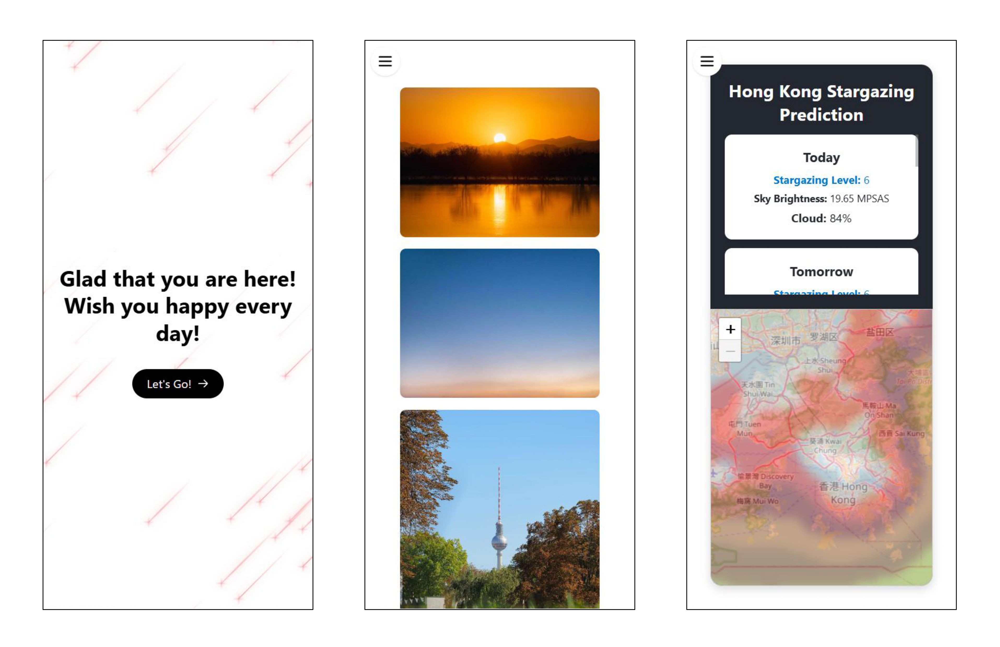

# Oscar Photography

Link to the website: https://oscar-photography.vercel.app/

# Development Logs

## 29/05/2025

- Add pre-trained prediction Random Forest model
- Add weather api from [Open_Meteo](https://open-meteo.com/), of 35 weather elements for 7 days forecast
- Deployed the backend in [Render](https://render.com/)

## 27/05/2025

- Initiate Hong Kong Stargazing Page
- Light pollution map source from [Mr. David Lorenz](https://djlorenz.github.io/astronomy/lp/), blurred using Gaussian blur in Photoshop
  

## 24/05/2025

- Add more photos and descriptions
- Cancel enlargment window scroller
- Enhance image fade-in animation

## 23/05/2025

- Enhance UI fluency, now Home page photos fade in after fully loading
- Adjust photo description alignment to the left

## 22/05/2025

- Add full screen viewing photo mode, previous photo and next photo buttons
  

## 21/05/2025

- Add photo enlargement window
- Enhance fluency of Welcome page shooting stars
- Add show and hide button for sidebar
- Deployed the frontend in [Vercel](https://vercel.com/)

## 20/05/2025

- Improve old website project from 2023 summer
- Add Welcome, Home, About me, and Contact page, with last two as drafts
- Enhance shooting star animation, add greetings and let's go button
- Add photos to Home page, adapts Waterfall Design
- Deploy website at Vercel
- Lo-Fi Website Design
  
